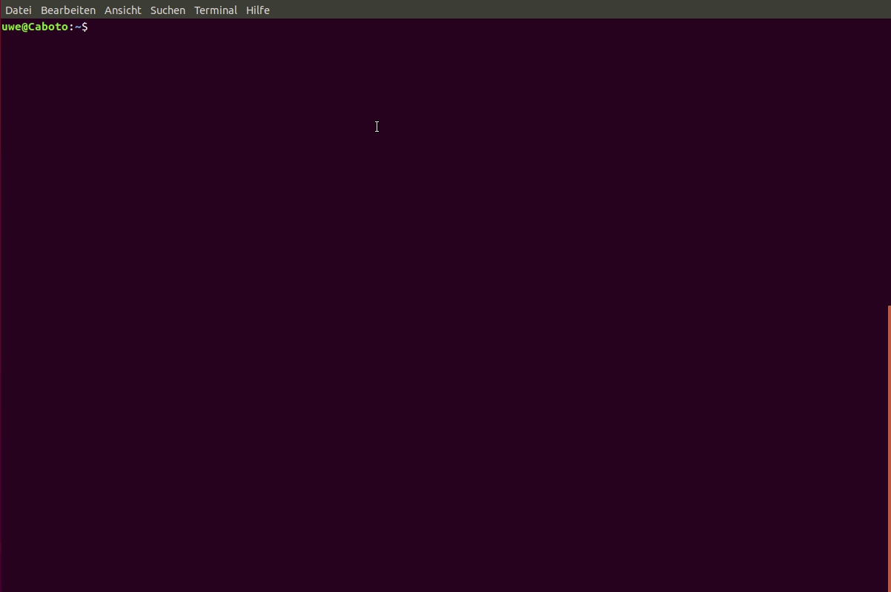

<!-- ABOUT KIRBYTOOLS-->
## kirbytools
[](https://github.com/Adspectus/kirbytools/releases)
[](https://github.com/Adspectus/kirbytools/issues)
[](https://github.com/Adspectus/kirbytools/blob/master/LICENSE)
[](https://getkirby.com/)


The __kirbytools__ package is a collection of shell scripts which should ease and speed the installation and management of the [Kirby CMS](https://getkirby.com/) on your machine. It covers the process from downloading an appropriate Kirby package from Github to your local machine, installing (unpacking and copying) to a new virtual host, and eventually deinstalling it. Furthermore, it can set up a new virtual host configuration for an Apache2 webserver.


<!-- TABLE OF CONTENTS -->
## Contents

* [Getting Started](#getting-started)
* [Usage](#usage)
  * [Download a given Kirby package](#download-a-given-kirby-package)
  * [Install a given Kirby package](#install-a-given-kirby-package)
  * [Set up a Kirby virtual host](#set-up-a-kirby-virtual-host)
  * [Remove a given virtual host](#remove-a-given-virtual-host)
* [Options](#options)
  * [Replacing the kirby folder with a symbolic link](#replacing-the-kirby-folder-with-a-symbolic-link)
  * [Adding your default admin account](#adding-your-default-admin-account)
  * [Enabling the panel](#enabling-the-panel)
  * [Creating virtual host configuration file(s)](#creating-virtual-host-configuration-file-s)
* [License](#license)


<!-- GETTING STARTED -->
## Getting Started

### Prerequisites

* Debian based OS
* Dependencies (will be installed if not already there)
  * curl
  * php (libapache2-mod-php or php-cgi)
  * jq
  * wget

### Installation

See the installation instructions in [INSTALL.md](./INSTALL.md).

After installation of the package, run the script _kirbyconfigure_ with:

```sh
$ kirbyconfigure
```

The _kirbyconfigure_ script creates a file `$HOME/.kirbyrc` with necessary settings and default values which will be used by the other scripts in the package. You will be presented with a couple of questions about settings and default values of environment variables which are described in the manpage of _kirbyconfigure_. Many questions will be presented with a reasonable default value in blue, which can be accepted by hitting return. Other questions will need the user to type in values or leave them empty. It is possible to change some or all variables by editing the file `$HOME/.kirbyrc` directly, but take care of the dependencies and make sure you know what you are doing.

You can run the _kirbyconfigure_ script over and over again to recreate the `$HOME/.kirbyrc` file if you wish.


<!-- USAGE EXAMPLES -->
## Usage

For any of the scripts described here the tab-completion feature of the shell is activated. Try it by pressing `<tab>` or `<tab><tab>` after a command or option.

> All scripts described below are fetching the information about available Kirby releases from GitHub with curl against the GitHub API. By default you can only query the API 60 times per hour unless you authenticate the call. Authentication can be done by creating or editing the file `.netrc` in your home directory. For GitHub, it should contain the following line:
> ```
> machine api.github.com login YOUR_GITHUBUSER password YOUR_GITHUB_ACCESS-TOKEN
> ```
> curl will recognize this and authenticate the call with the given credentials.
> 
> The Access-Token is to be created in your GitHub account settings and should contain at least the scope _public-repo_. The `.netrc` must be owned by your user and have mode `0600`. 
> 
> To mitigate further against the rate limit in case you are not providing credentials, the first call will not only fetch the release information but save it in 2 "cache" files in your home directory, `.kirby-plainkit-tags.json` and `.kirby-starterkit-tags.json` resp. If these files exist, the next call against the API will include a `If-Modified-Since` header.  GitHub API calls with this header are not counted against the rate limit. If the release information on GitHub is not newer than the provided date (= creation date of the files), the release information is fetched from the cache files.

### Download a given Kirby package

The _kirbydownload_ script makes it easy to just download a Kirby package from GitHub to your local machine:

```sh
$ kirbydownload
```

If you have accepted the default values when creating the file `$HOME/.kirbyrc` with the _kirbyconfigure_ script, this command will:

1. Download the most recent version of the starterkit.
2. Save this package in `/usr/local/src/kirby` as `starterkit-3.3.6.tar.gz`.

It is possible to override the default values for the __kit__, the __version__, and the __target__ folder which have been set with the _kirbyconfigure_ command by command line parameters. For example, the command

```sh
$ kirbydownload -k plainkit -v 3.3.4 -t $HOME/Downloads
```

will download the plainkit, version 3.3.4 and save it as `plainkit-3.3.4.tar.gz` in your `Downloads` folder. The target folder must exists.

The _kirbydownload_ command has more options, use `kirbydownload -h` to see them all or refer to the manpage of _kirbydownload_.

### Install a given Kirby package

The _kirbyinstall_ script makes it easy to extract a Kirby package to your virtual hosts root folder:

```sh
$ kirbyinstall
```

If you have accepted the default values when creating the file `$HOME/.kirbyrc` with the _kirbyconfigure_ script, this command will:

1. Download and save the most recent version of the starterkit by means of the _kirbydownload_ script, if it does not already exists in `/usr/local/src/kirby`.
2. Create a subdirectory named `kirby-` followed by a random string of 8 lowercase letters in `$HOME/vhosts`.
3. Extract the given Kirby package to the subdirectory `htdocs` within the directory created in step 2.

Hence, the final result will look like this (assuming the random string has been created as `xtkxqema`):

```
$HOME/vhosts/
└── kirby-xtkxqema
    └── htdocs
        ├── assets
        ├── composer.json
        ├── content
        ├── .editorconfig
        ├── .gitignore
        ├── .htaccess
        ├── index.php
        ├── kirby
        ├── media
        ├── README.md
        └── site
```

It is possible to override the default values for the __package__ (= __kit__ + __version__) and the __subdirectory__ name for the virtual host. For example, the command

```sh
$ kirbyinstall -p plainkit-3.3.4 -w test01
```

will download the plainkit, version 3.3.4 according to the steps in [Download a given Kirby package](#download-a-given-kirby-package) above, create a subdirectory named `test01` in `$HOME/vhosts` and extract the kit to the `htdocs` subdirectory of `$HOME/vhosts/test01`.

Hence, the final result will look like this:

```
$HOME/vhosts/
└── test01
    └── htdocs
        ├── composer.json
        ├── content
        ├── .editorconfig
        ├── .gitignore
        ├── .htaccess
        ├── index.php
        ├── kirby
        ├── media
        ├── README.md
        └── site
```

The _kirbyinstall_ command has more options, use `kirbyinstall -h` to see them all or refer to the manpage of _kirbyinstall_.

### Set up a Kirby virtual host

The _kirbysetup_ script makes it easy to create a Kirby virtual host by combining the _kirbydownload_ and _kirbyinstall_ scripts __and__ optionally create a virtual host configuration file for the apache2 webserver.

The _kirbysetup_ script does not know any command line parameters (except `-h` and `-d`). Instead it will ask the relevant settings interactively, with defaults from the `$HOME/.kirbyrc` file in blue. You can just hit return to accept the default value or type in a new one. 



From the screencast above it is quite clear that the script will install (download if necessary) the starterkit, version 3.3.6 into a virtual host folder named `kirby-eoaxvbtd`. In addition to that, the script gives you the option to either [create your default Kirby panel admin user](#adding-your-default-admin-account) or [enable the panel](#enabling-the-panel). Furthermore, it will look into the `templates` subdirectory of your apache configuration files root folder (as configured by the _kirbyconfigure_ script) and - if it finds appropriate named template files - will [create virtual host configuration files](#creating-virtual-host-configuration-file-s) for the just created Kirby website. If you want, the script then will activate the configuration, test if it is syntactically correct (by means of the `sudo apachectl configtest` command) and - if that does not throw an error, will reload the webserver configuration with `sudo apachectl graceful`. See [Options](#options) below for further details.

The __Meaningful name__ and the __Description__ will only appear as a comment in your virtual host configuration file in order to better identify the given virtual host.

Nothing will be done if you are not satisfied with your settings and answer the resp. question with "n".

See also the manpage of _kirbysetup_.

### Remove a given virtual host

The _kirbydeinstall_ script makes it easy to deinstall a previous installed virtual host by removing the vhost directory recursively. It is not limited to remove Kirby virtual hosts only but any virtual host in your virtual hosts root directory (which is `$HOME/vhosts` by default). The command knows only one parameter (except `-h` and `-d`) which must be given:

```sh
$ kirbydeinstall -w <vhost>
```

The `<vhost>` may be any valid virtual host directory, i.e. `kirby-xtkxqema`, `test01` or `kirby-eoaxvbtd` if we would have installed these according to the examples above.

Wildcards are allowed, hence `kirbydeinstall -w kirby-*` will remove all virtual hosts starting with `kirby-`, i.e. the virtual hosts `kirby-xtkxqema` and `kirby-eoaxvbtd`, but not `test01` in our example.

To be on the safe side, you have to confirm the removal of every virtual host.

Before removal of the virtual host folder, the script will deactivate any virtual host configuration file which is still active for this host. This is done by means of the `vhostdissite` program if present or by removing the symlink(s) from the `sites-enabled` directory. If one of these is successful, the webserver configuration will be reloaded with `sudo apachectl graceful`. Finally you will be asked if you like to remove the virtual host configuration file(s) from the `sites-available` directory also.

## Options

### Replacing the kirby folder with a symbolic link

If you like, you can replace the `kirby` program folder in your virtual host directory with a symbolic link pointing to the same versions `kirby` folder outside the webserver structure. This makes sense if you are going to create multiple virtual hosts which are based upon the same version of Kirby. However, even if you have only one Kirby website per version, it enables easier up- and downgrading by just replacing the target of the symbolic link. See the Kirby cookbook recipe [A variant to using Kirby for multiple sites](https://getkirby.com/docs/cookbook/setup/multisite-variant) for further details.

You can enable the replacement of the `kirby` program folder with a symbolic link by adding the option `-l` to the _kirbydownload_ and _kirbyinstall_ commands. The _kirbysetup_ command however will ask you, if you would like to do this. If yes, The `kirby` program folder will be placed in `/usr/local/lib/kirby` or any other folder which you can configure with the _kirbyconfigure_ command.

This is how the folder `/usr/local/lib/kirby` might look after installation of 3 different versions of Kirby:

```
/usr/local/lib/kirby/
├── 3.3.4
├── 3.3.5
└── 3.3.6
```
And this is how the vhosts directory would look like:

```
$HOME/vhosts/
├── kirby-xtkxqema
│   └── htdocs
│       ├── assets
│       ├── composer.json
│       ├── content
│       ├── .editorconfig
│       ├── .gitignore
│       ├── .htaccess
│       ├── index.php
│       ├── index.php.bak
│       ├── kirby -> /usr/local/lib/kirby/3.3.6
│       ├── media
│       ├── README.md
│       └── site
```

> Yes, there is indeed a file `index.php.bak` now. The _kirbyinstall_ script has created this backup file before changing the `index.php` file in order to reflect the different setup.

### Adding your default admin account

If you wish, you can create an admin account to the panel right after installation of the Kirby site. For that, you will need to put at least your username/email-address and your password in cleartext into the file `$HOME/.kirbyrc` by answering the resp. questions of the _kirbyconfigure_ command. Optionally, you can also give your full name.

> Because in general it is not a good idea to store plaintext passwords in a file, the `$HOME/.kirbyrc` file will be owned by your user and saved with mode `0600`, i.e. it is only readable by you (and system administrators).

The _kirbysetup_ script will call a php script named `createUser.php` with the necessary parameters which will create the user. This script is located in `/usr/share/kirbytools` by default, but you can change that with the _kirbyconfigure_ command.

### Enabling the panel

If you do not create an admin account right after installation it might be that you cannot access the panel of this installation because of Kirby security settings. You will need to modify your `site/config/config.php` file to activate the panel in this case. The _kirbysetup_ script can do this for you if you like. Just answer "y" to the resp. question, which will only be asked if you opt out the creation of the admin panel user before.

If you are installing a plainkit, the `config` directory and the `config.php` file will be created for you, because the plainkit does not contain these. If you are installing a starterkit, the `config.php` will be changed and the old version saved as `config.php.bak`.

### Creating virtual host configuration file(s)

The _kirbysetup_ script is able to create virtual host configuration files in the `sites-available` subdirectory of the apache2 configuration directory, based on templates in the `templates` subdirectory (as defined by the _kirbyconfigure_ script in `$HOME/.kirbyrc`).

For that to work, you have to put configuration templates into the `templates` subdirectory, the name of the files must start with the KIRBYSUFFIX defined in `$HOME/.kirbyrc` and continued with `-vhost-<something>` and end in `.template`. For example, `kirby-vhost-SSL.template`would be correct, `my-kirby-ssl.template` not.

The content of those files should be apache2 configuration directives for a virtual host. The directives can contain Apache variables (like `${APACHE_IP}`) which have to be defined elsewhere, and placeholders (like `<VHOST>`) which will be replaced by the _kirbysetup_ script during installation. Currently, only `<VHOST>`, `<VHOSTROOT>`, and `<HTDOCSDIR>`are valid placeholders which will be replaced.

This package comes with example templates which you will find in `/usr/share/doc/kirbytools/examples`. See the file `README.templates` in the same directory for further details.

<!-- LICENSE -->
## License

[GNU General Public License v3.0](LICENSE)
