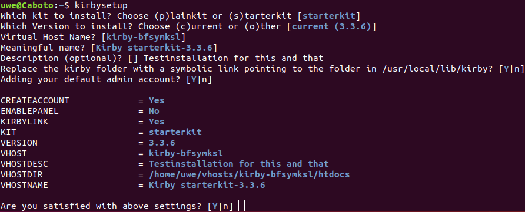

[](https://github.com/Adspectus/kirbytools/issues)
[](https://github.com/Adspectus/kirbytools/blob/master/LICENSE)
[](https://getkirby.com/)

<!-- TABLE OF CONTENTS -->
## Table of Contents

* [About](#about)
* [Getting Started](#getting-started)
* [Usage](#usage)
  * [Download a given Kirby package](#download-a-given-kirby-package)
  * [Install a given Kirby package](#install-a-given-kirby-package)
  * [Set up a Kirby virtual host](#set-up-a-kirby-virtual-host)
  * [Remove a given virtual host](#remove-a-given-virtual-host)
* [Options](#options)
  * [Replacing the kirby folder with a symbolic link](#replacing-the-kirby-folder-with-a-symbolic-link)
  * [Adding your default admin account](#adding-your-default-admin-account)
  * [Enabling the panel](#enabling-the-panel)
  * [Creating virtual host configuration file(s)](#creating-virtual-host-configuration-file-s)
* [License](#license)


<!-- ABOUT -->
## About

The __kirbytools__ package is a collection of shell scripts which should ease and speed the installation and management of the [Kirby CMS](https://getkirby.com/) on your machine. It covers the process from downloading an appropriate Kirby package from Github to your local machine, installing (unpacking and copying) to a new virtual host, and eventually deinstalling it.

<!-- GETTING STARTED -->
## Getting Started

### Prerequisites

* Debian based OS
* curl
* php
* jq
* wget

### Installation

1. Add my Debian repository to your list of sources, either by adding the following line to `/etc/apt/sources.list`
   
    ```
    deb https://repo.uwe-gehring.de/apt/debian ./  # Uwe Gehring's repo
    ```
   
   or better create a new file `/etc/apt/sources.list.d/uwe-gehring.list` with:
   
    ```sh
    $ sudo echo "deb https://repo.uwe-gehring.de/apt/debian ./" > /etc/apt/sources.list.d/uwe-gehring.list
    ```

2. Import verification key with:
   
    ```sh
    $ wget -qO - https://repo.uwe-gehring.de/apt.key | sudo apt-key add -
    ```

3. Refresh apt database:
   
    ```sh
    $ sudo apt-get update
    ```

4. Install the package with
   
    ```sh
    $ sudo apt-get install kirbytools
    ```
   Optionally install also the package [vhostmanager](https://github.com/Adspectus/vhostmanager).


5. Run the script _kirbyconfigure_ with:
   
    ```sh
    $ kirbyconfigure
    ```
   
   The _kirbyconfigure_ script creates a file `$HOME/.kirbyrc` with necessary settings and default values which will be used by the other scripts in the package. You will be presented with a couple of questions about settings and default values of environment variables which are described in the manpage of _kirbyconfigure_. Many questions will be presented with a reasonable default value in blue, which can be accepted by hitting return. Other questions will need the user to type in values or leave them empty. It is possible to change some or all variables by editing the file `$HOME/.kirbyrc` directly, but take care of the dependencies and make sure you know what you are doing.


<!-- USAGE EXAMPLES -->
## Usage

For any of the scripts described here the tab-completion feature of the shell is activated. Try it by pressing `<tab>` or `<tab><tab>` after a command or option.
### Download a given Kirby package

The _kirbydownload_ script makes it easy to just download a Kirby package from GitHub to your local machine:

```sh
$ kirbydownload
```

If you have accepted the default values when creating the file `$HOME/.kirbyrc` with the _kirbyconfigure_ script, this command will:

1. Download the most recent version of the starterkit.
2. Save this package in `/usr/local/src/kirby` as `starterkit-3.3.6.tar.gz`.

It is possible to override the default values for the __kit__, the __version__, and the __target__ folder which are given by the `$HOME/.kirbyrc` file, by command line parameters. I.e. the command

```sh
$ kirbydownload -k plainkit -v 3.3.4 -t $HOME/Downloads
```

will download the plainkit, version 3.3.4 and save it as `plainkit-3.3.4.tar.gz` in your `Downloads` folder. The target folder must exists.

The _kirbydownload_ command has more options, use `kirbydownload -h` to see them all or refer to the manpage of _kirbydownload_.

### Install a given Kirby package

The _kirbyinstall_ script makes it easy to extract a Kirby package to your virtual hosts root folder:

```sh
$ kirbyinstall
```

If you have accepted the default values when creating the file `$HOME/.kirbyrc` with the _kirbyconfigure_ script, this command will:

1. Download and save the most recent version of the starterkit by means of the _kirbydownload_ script, if it does not already exists in `/usr/local/src/kirby`.
<!-- 2. Extract the `kirby` program dir from this package to `/usr/local/lib/kirby/VERSION` (see below for details) -->
2. Create a subdirectory named `kirby-` followed by a random string of 8 lowercase letters in `$HOME/vhosts`.
3. Extract the given Kirby package to the subdirectory `htdocs` within the directory created in step 2.

Hence, the final result will look like this (assuming the random string has been created as `xtkxqema`):

```
$HOME/vhosts/
└── kirby-xtkxqema
    └── htdocs
        ├── assets
        ├── composer.json
        ├── content
        ├── .editorconfig
        ├── .gitignore
        ├── .htaccess
        ├── index.php
        ├── kirby
        ├── media
        ├── README.md
        └── site
```

It is possible to override the default values for the __package__ to install and the __subdirectory__ name for the virtual host. I.e. the command

```sh
$ kirbyinstall -p plainkit-3.3.4 -w test01
```

will download the plainkit, version 3.3.4 according to the steps in [Download a given Kirby package](#download-a-given-kirby-package) above, create a subdirectory named `test01` in `$HOME/vhosts` and extract the plainkit, version 3.3.4 to the `htdocs` subdirectory of `$HOME/vhosts/test01`.

Hence, the final result will look like this:

```
$HOME/vhosts/
└── test01
    └── htdocs
        ├── composer.json
        ├── content
        ├── .editorconfig
        ├── .gitignore
        ├── .htaccess
        ├── index.php
        ├── kirby
        ├── media
        ├── README.md
        └── site
```

The _kirbyinstall_ command has more options, use `kirbyinstall -h` to see them all or refer to the manpage of _kirbyinstall_.

### Set up a Kirby virtual host

The _kirbysetup_ script makes it easy to create a Kirby virtual host by combining the _kirbydownload_ and _kirbyinstall_ scripts __and__ optionally create a virtual host configuration file for the apache2 webserver.

The _kirbysetup_ script does not know any command line parameters (except `-h` and `-d`). Instead it will ask the relevant settings interactively, with defaults in blue from the `$HOME/.kirbyrc` file. You can just hit return to accept the default value or type in a new one. 



From the screenshot above it is quite clear that the script will download (if necessary) and install the starterkit, version 3.3.6 into a virtual host folder named `kirby-bfsymksl`. In addition to that, the script gives you the option to either [create your default Kirby panel admin user](#adding-your-default-admin-account) or [enable the panel](#enabling-the-panel). Furthermore, it will look into the `templates` subdirectory of your apache configuration files root folder (as configured by the _kirbyconfigure_ script) and - if it finds appropriate named template files - will [create virtual host configuration files](#creating-virtual-host-configuration-file-s) for the just created Kirby website.

The __Meaningful name__ and the __Description__ will only appear as a comment in your virtual host configuration file in order to better identify the given virtual host.

Nothing will be done if you answer the last question with "n".

See also the manpage of _kirbysetup_.

### Remove a given virtual host

The _kirbydeinstall_ script makes it easy to deinstall a previous installed virtual host by removing the vhost directory recursively. It is not limited to remove Kirby virtual hosts only but any virtual host in your virtual hosts root directory (which is `$HOME/vhosts` by default). The command knows only one parameter (except `-h` and `-d`) which must be given:

```sh
$ kirbydeinstall -w <vhost>
```

The `<vhost>` may be any valid virtual host directory, i.e. `kirby-xtkxqema`, `test01` or `kirby-bfsymksl` if we would have installed these according to the examples above.

Wildcards are allowed, hence `kirbydeinstall -w kirby-*` will remove all virtual hosts starting with `kirby-`, i.e. the virtual hosts `kirby-xtkxqema` and `kirby-bfsymksl`, but not `test01` in our example.

To be on the safe side, you have to confirm the removal of every virtual host.

Before removal of the virtual host folder, the script will deactivate any virtual host configuration file which is still active for this host. This is done by means of the `vhostdissite` program if present or by removing the symlink(s) from the `sites-enabled` directory. If one of these is successful, the webserver will be reloaded with `sudo apachectl graceful`. Finally you will be asked if you like to remove the virtual host configuration file(s) from the `sites-available` directory.

## Options

### Replacing the kirby folder with a symbolic link

### Adding your default admin account

### Enabling the panel

### Creating virtual host configuration file(s)

<!-- LICENSE -->
## License

[GNU General Public License v3.0](LICENSE)
